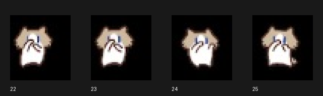

# 手机 Work 显示与验证范围 · Mobile Work test scope

2026-09-26，通过真实 iPhone 镜像测试，未用浏览器窄屏模拟。 
Tested on September 26, 2026 using an actual iPhone through iPhone Mirroring, not a narrow browser simulation.

| 图集 · Atlas | 思考／处理 · Reasoning / processing | 联网搜索 · Web search | 完成后 · After completion |
| --- | --- | --- | --- |
| 原九状态月薪喵 · Original nine-state Yuexinmiao | 挠头看电脑 · Head-scratching at the computer | 挠头看电脑 · Head-scratching at the computer | 状态图标隐藏 · Status icon hidden |
| 官方默认 Codex（对照）· Official default Codex pet (control) | 官方动画循环 · Official animation loop | 未见明显动作组切换 · No clear animation-group switch | 状态图标隐藏 · Status icon hidden |
| Work 捂鼻扇风专用版 · Work fanning edition | Python 处理时捂鼻扇风 · Fanning during Python processing | 捂鼻扇风 · Nose-covering and fanning | 状态图标隐藏 · Status icon hidden |

这里只描述已采样的实际行为，不保证捕获每个瞬间。其他客户端、等待授权、失败等分支未验证；移动端完整状态映射仍需官方说明或进一步实测，不能宣称“官方只支持一种状态”。[官方 Pets 文档](https://learn.chatgpt.com/docs/pets)说明显示取决于使用界面，并未列出完整 iPhone 状态映射。 
These observations describe sampled behavior, not every instant. Other clients, approval waits, failures, and other branches remain untested. A complete mobile mapping requires further testing or official documentation; this does not establish that mobile officially supports only one state. The [official Pets documentation](https://learn.chatgpt.com/docs/pets) describes display as depending on the surface, without listing a complete iPhone state mapping.

## 从 v1.0.0 到 v1.1.0：为什么更换动作 · Why the animation changed

手机 Work 从 v1.0.0 的「挠头思考」改为 v1.1.0 专用版的经典「捂鼻扇风」：目前在已测试的思考、搜索和计算处理场景中，只观察到同一组动画，未见其他动作切换，因此选择更有辨识度、更能代表月薪喵的招牌动作。其他手机状态是否可触发仍待确认，不代表官方已明确只支持一种状态。本机 Codex 九种动作保持不变。 
The Work edition replaces v1.0.0’s head-scratching animation with the signature nose-covering and fanning gesture. The tested reasoning, search, and computation stages showed one animation group, so a more recognizable gesture was chosen. Other mobile states remain unverified; these observations do not establish that mobile officially supports only one state. The local Codex edition retains all nine animations.

## Work 专用版的差异 · What differs in the Work edition

- 文件：`dist/yuexinmiao-work-fanning/spritesheet.webp`，透明 WebP，1536×1872，spriteVersionNumber 1。 
  File: `dist/yuexinmiao-work-fanning/spritesheet.webp`, transparent WebP, 1536×1872, `spriteVersionNumber: 1`.

- 行号从 0 开始：仅第 8 行 review 改为原第 4 行捂鼻扇风素材；五张原帧映射为六个槽位 `[0,1,2,2,3,4]`，中间帧有意重复一次。 
  Only zero-based row 8 (`review`) uses the original row 4 fanning artwork. Its five original frames fill six slots as `[0,1,2,2,3,4]`, deliberately repeating the middle frame once.

- 像素原样复用，无重绘、缩放或调色；其余八行不变。本机安装器仍安装九状态桌面版。 
  Pixels are reused without redrawing, resizing, or recoloring; the other eight rows remain unchanged. The local installer still installs the nine-state desktop edition.

- Work 使用账号级选择，网页版也会使用此图集；不是仅 iPhone 私有的覆盖设置。 
  Work selection is account-level and affects web Work too; it is not an iPhone-only override.

- 宠物出现时播放目标动作，任务结束后的隐藏由 Work 决定；不是屏幕常驻浮窗。 
  The chosen gesture plays when the pet is visible. Work controls hiding after task completion; it is not a permanently floating overlay.

- 手机存在设置同步／缓存延迟。首次测试仍显示旧宠物，不计为通过；重新进入应用并核对个性化设置后，已验证新动作及多帧变化。 
  Mobile settings may synchronize slowly or retain cached artwork. The first test still showed the old pet and was not counted as a pass. Reopening the app and checking personalization settings was followed by verified new motion with distinct frames.

公开仓库仅含宠物局部截图，不包含个人设置、账号或完整对话截图。当前维护者账号已启用新版并清理旧 Work 条目；下载者需在自己的账号上传、选择和验证。 
Public screenshots exclude personal settings, account details, and full conversations. The maintainer’s account has the new entry selected and older Work entries removed; users must upload, select, and verify it in their own accounts.
