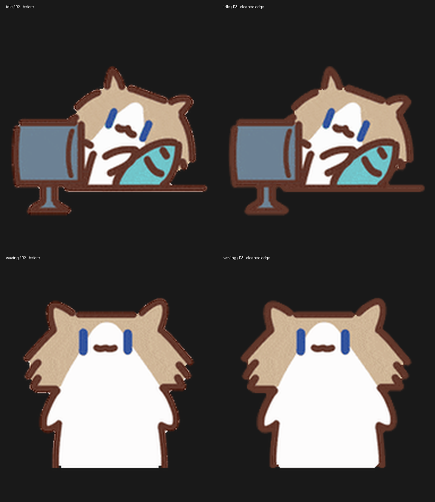

# 深色背景边缘修正（R3，本机候选）

本轮处理摸鱼待机 6 帧和打招呼 4 帧，去除白底污染以及棕色外轮廓中的浅色细线，并仅对轮廓透明度做轻度抗锯齿。没有整体模糊、重绘角色或修改动作帧序与播放时长。其他 47 帧保持逐字节一致。

这是现有位图的边缘修复，不是 SVG 矢量化；固定分辨率图集放大后仍有分辨率上限。自动结构校验通过不代表真实应用最大尺寸已验收。GitHub、Release 和 Work 暂不更新，等待本机效果确认。

执行 scripts/build.py 可从修正后的源帧重建。clean_light_outline.py 只用于原版帧的一次性转换，不要重复处理已修正版。
